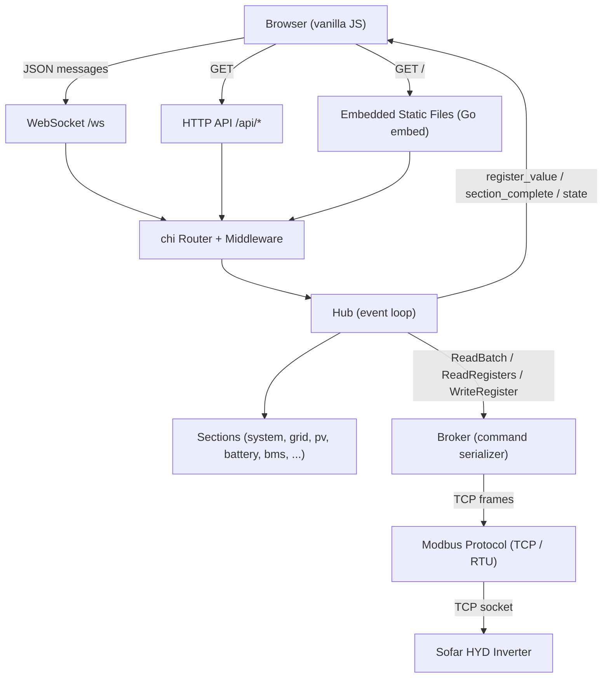

<!-- generated-by: gsd-doc-writer -->
# Architecture

## System overview

Sofar HYD Diagnostic Tool is a desktop-focused web application for monitoring and diagnosing Sofar HYD hybrid inverters via TCP Modbus. It is built as a single Go binary with an embedded HTML/JS/CSS frontend served over HTTP. The backend maintains a single persistent TCP connection to the inverter, serializes all Modbus reads and writes through a broker goroutine, and streams real-time register data to browser clients over WebSocket. The architecture follows a layered, event-driven design: a Modbus protocol layer handles framing, a broker serializes access to the shared TCP connection, a hub manages WebSocket clients and section-based subscriptions, and a vanilla JavaScript frontend renders register values as they stream in.

## Component diagram



## Data flow

A typical request-response cycle proceeds as follows:

1. **Browser connects** -- The frontend opens a WebSocket connection to `/ws`. The `web` package upgrades the HTTP connection using gorilla/websocket and registers a `Client` with the `Hub`. A dedicated `ReadPump` goroutine reads inbound JSON messages; a `WritePump` goroutine sends outbound messages and periodic pings.

2. **User initiates connection** -- The browser sends a `connect` message with the inverter host, port, and slave ID. The Hub forwards this to the `Broker` via `Reconfigure()`, which dials a TCP connection to the inverter (5-second timeout). The Broker emits a `StateEvent` (dormant -> connecting -> connected), which the Hub broadcasts as a `connection_state` message to all clients.

3. **Section subscription** -- The browser sends a `subscribe` message for a section (e.g., `"system"`). The Hub sends a `section_schema` message describing the section layout (group names, register names, layout hints) so the frontend can pre-render placeholder slots. If the broker is connected, the Hub immediately triggers a section read.

4. **Streaming register reads** -- The Hub dispatches section reads as streaming batch operations. The `BatchPlan` merges contiguous register addresses into `BatchSpan`s (up to 60 registers each) to minimize round-trips. Each span is sent to the Broker as a `ReadBatch` command. As results arrive, individual `register_value` messages stream to subscribed clients so the frontend can fill in values progressively. A `section_complete` message signals the end of a read cycle.

5. **Browser-driven refresh** -- The browser controls the read cadence via `read_cycle` messages. When auto-refresh is active, the browser sends `read_cycle` after each `section_complete` (with an optional inter-cycle delay). There are no server-side timers driving reads.

6. **BMS pack drill-down** -- For battery pack diagnostics, the browser sends a `select_pack` message with input/tower/pack coordinates. The Hub writes the pack selection register (0x9020) via the Broker, waits for a configurable settle time (default 1 second), then reads the pack's cell voltages, temperatures, and status registers. Results stream as `pack_data` messages.

7. **Error handling and reconnection** -- If a Modbus read fails, the Broker closes the TCP connection and enters a reconnection loop with exponential backoff (1s base, 30s cap). Non-retryable Modbus exceptions (e.g., illegal data address 0x02) return immediately without reconnection. The Hub cancels in-progress section reads on disconnect and broadcasts the state change to all clients.

## Key abstractions

| Abstraction | Location | Purpose |
|---|---|---|
| `Broker` | `internal/broker/broker.go` | Serializes all Modbus operations through a single goroutine command channel. Owns the TCP connection, handles auto-reconnection with exponential backoff, and emits connection state events. |
| `BrokerInterface` | `internal/hub/broker_iface.go` | Interface abstracting the Broker for testability. Defines `ReadRegisters`, `ReadBatch`, `WriteRegister`, `Reconfigure`, `Disconnect`, `SetDelayRuntime`, `CurrentState`, and `StateEvents`. |
| `Hub` | `internal/hub/hub.go` | Central event loop managing WebSocket clients, section subscriptions, and broker integration. All state mutations happen in the `Run()` goroutine. |
| `Client` | `internal/hub/client.go` | Represents a connected WebSocket client with dedicated `ReadPump` and `WritePump` goroutines. Each client subscribes to one section at a time. |
| `Section` | `internal/hub/section.go` | Represents a data section (e.g., system, grid, battery) with subscriber tracking, a `BatchPlan` for optimized reads, and a `SpanTracker` for graceful degradation. |
| `SpanTracker` | `internal/hub/batch.go` | Tracks consecutive batch failures per span. Transitions spans through Normal -> Degraded (individual reads) -> Skipped states, with periodic probe attempts for recovery. |
| `Probe` | `internal/register/probe.go` | Metadata for a single register read: address, count, data type (ASCII, signed, unsigned, U32, enum, composite), unit, and scaling factor. |
| `ProbeGroup` | `internal/register/probe_group.go` | Groups related probes with a name, optional layout hint (`"column"` for side-by-side rendering), and optional type (`"bitmap"`, `"protection"`). |
| `BatchPlan` / `BatchSpan` | `internal/register/batch.go` | Pre-computed batch read strategy. `AnalyzeBatchPlan()` merges contiguous register ranges across group boundaries into spans (max 60 registers per Modbus request) and separates synthetic probes into an unbatchable list. |
| `Backoff` | `internal/broker/backoff.go` | Exponential backoff with cap (1s base, 30s max) for TCP reconnection attempts. |

## Directory structure rationale

```
modbus_reader/
+-- cmd/
|   +-- server/          # Main entry point (HTTP server + broker + hub wiring)
|   +-- fyne-poc/        # Experimental Fyne desktop GUI (proof of concept, not primary)
+-- internal/
|   +-- broker/          # Modbus connection serializer (single-goroutine command pattern)
|   +-- hub/             # WebSocket hub, client management, section reads, streaming
|   +-- modbus/          # Protocol codec (TCP and RTU framing, CRC-16, connection dial)
|   +-- register/        # Register definitions, probe metadata, batch planning, formatting
+-- web/
|   +-- handler.go       # HTTP route setup (chi router), WebSocket upgrade, embedded FS
|   +-- static/          # Frontend assets (index.html, app.js, style.css) served via Go embed
+-- tools/
|   +-- config-sweep/    # Diagnostic tool: sweep configuration registers
|   +-- section-sweep/   # Diagnostic tool: sweep section registers to find working ones
|   +-- xlsx-discover/   # Parses Sofar XLSX protocol spec to discover/compare registers
+-- main.go.bak          # Original monolithic CLI tool (preserved as reference)
+-- Makefile             # Build targets: server, discover, test, clean
+-- go.mod               # Module: sofar-hyd-diag, Go 1.26
```

**`cmd/server/`** -- The application entry point. Parses CLI flags (`-listen`, `-inverter-host`, `-inverter-port`, `-slave`, `-modbus-mode`, `-pv-channels`, `-log-level`), wires together the Broker, Hub, and HTTP router, and manages graceful shutdown via OS signals.

**`internal/broker/`** -- Implements the single-goroutine command serialization pattern. All Modbus operations (read, write, batch read, reconfigure, disconnect) flow through a buffered command channel. This eliminates concurrent TCP access and enables transparent reconnection. The broker tracks connection state (dormant, connecting, connected, reconnecting, disconnected) and emits state events consumed by the Hub.

**`internal/hub/`** -- The real-time coordination layer. The Hub event loop processes client registrations, section subscriptions, broker state events, and read results on a single goroutine (no mutex needed for Hub state). Section reads run in background goroutines that stream results back through a channel. The Hub supports per-section streaming, BMS pack drill-down with write-settle-read cycles, configurable PV channel count, and span degradation tracking.

**`internal/modbus/`** -- Pure protocol implementation with no application logic. Provides `ReadHoldingRegistersTCP`, `WriteMultipleRegistersTCP`, `ReadHoldingRegistersRTU`, `WriteSingleRegisterRTU`, `Connect`, `ReadFull`, and `CRC16`. Transaction ID matching in TCP mode skips stale responses. Write uses function 0x10 (Write Multiple Registers) because function 0x06 (Write Single Register) times out on the Sofar inverter for register 0x9020.

**`internal/register/`** -- Declarative register definitions covering all Sofar Modbus-G3 V1.38 sections: system, configuration, grid, EPS, PV, battery, BMS, meter, PCU, BDU, fault codes, and statistics. Each section is defined as a slice of `ProbeGroup`s with typed `Probe` entries. The `batch.go` module computes optimal batch read plans by merging contiguous address ranges. The `format.go` module handles value interpretation (ASCII strings, scaled integers, signed/unsigned, 32-bit values, enum lookups, composite fields like system time and BMS clock).

**`web/`** -- HTTP layer using chi router with gorilla/websocket for the real-time channel. Static files (HTML, JS, CSS) are embedded into the binary via `//go:embed static/*`. The frontend is vanilla JavaScript with no build step or framework dependencies, rendering a section-based navigation UI with skeleton pre-rendering, streaming value updates, BMS pack topology visualization, and configurable timing parameters.

**`tools/`** -- Standalone diagnostic utilities built from the same module. `xlsx-discover` parses the Sofar XLSX protocol specification to discover registers and compare them against the codebase definitions. `config-sweep` and `section-sweep` probe the inverter to find which registers respond successfully on actual hardware.
