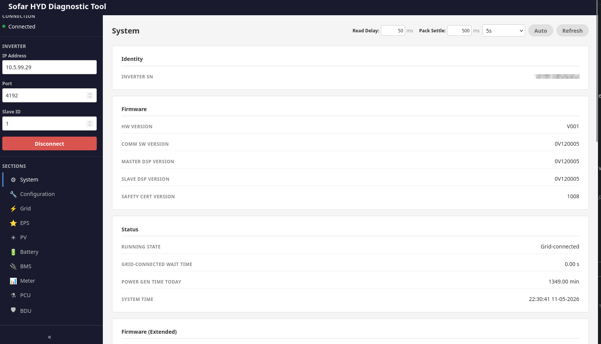
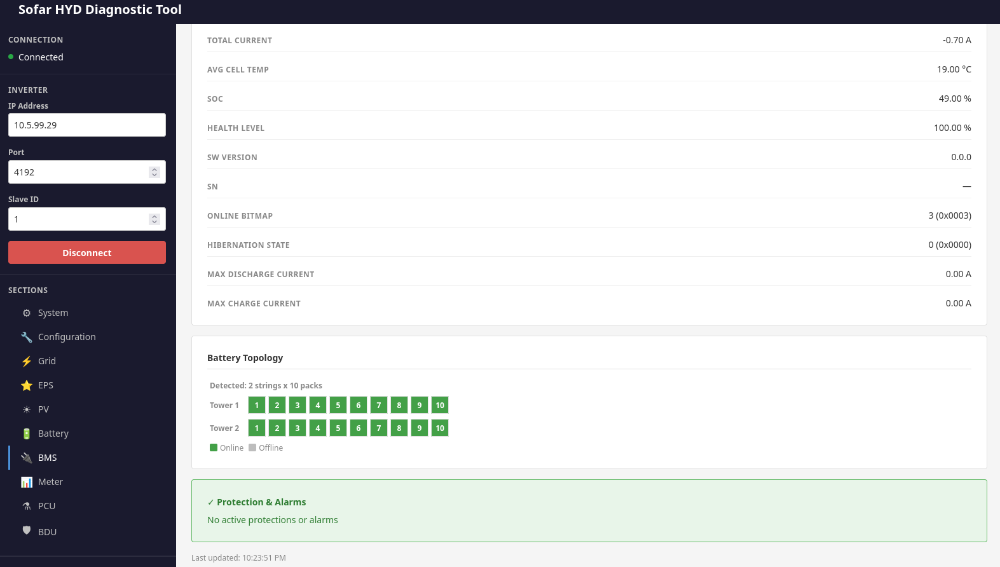
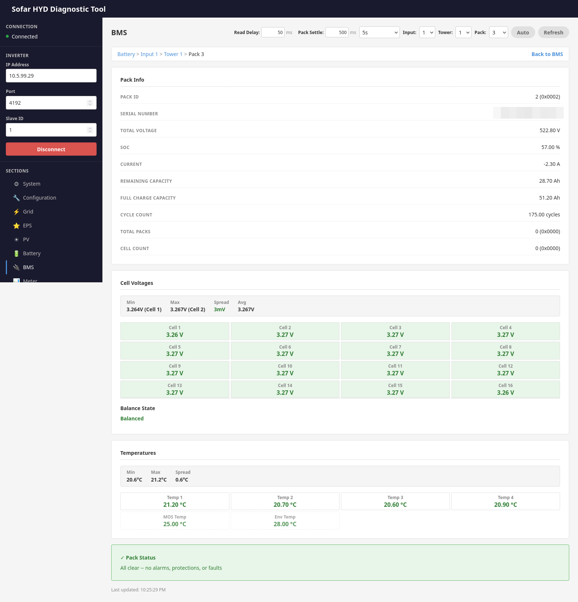

<!-- generated-by: gsd-doc-writer -->
# Getting Started

This guide walks you through setting up and running the Sofar HYD Diagnostic Tool for the first time.

## Prerequisites

- **Go 1.26** or later -- the project uses Go modules and language features from Go 1.22+ (range over integers). Verify your Go installation with:
  ```bash
  go version
  ```
- **Network connectivity** to a Sofar HYD hybrid inverter on its Modbus TCP port (default 4192). The machine running the tool must be able to reach the inverter's IP address over the local network.
- **Git** for cloning the repository.

No external runtime libraries, databases, or containers are required. The tool compiles to a single self-contained binary.

## Installation steps

1. Clone the repository:
   ```bash
   git clone git@github.com:egeek-tech/sofar-HYD-diag.git
   ```

2. Change into the project directory:
   ```bash
   cd sofar-HYD-diag
   ```

3. Download Go module dependencies:
   ```bash
   go mod download
   ```

4. Build the server binary:
   ```bash
   make server
   ```

This compiles the Go backend and embeds the HTML/JS/CSS frontend into a single `server` binary in the project root. No additional install steps are needed.

## First run

Start the server by pointing it at your inverter's IP address:

```bash
./server -inverter-host 192.168.1.100
```

You should see output similar to:

```
Sofar HYD Diagnostic Tool listening on http://localhost:8080
```

Open `http://localhost:8080` in your browser. The web UI will load with the inverter address pre-populated from the CLI flag. Use the sidebar to connect to the inverter and subscribe to data sections (System, PV, Battery, BMS, etc.) to start streaming real-time register values.

To stop the server, press `Ctrl+C`. It performs a graceful shutdown with a 5-second timeout.

## User Interface

The web interface provides real-time visibility into all inverter parameters through organized sections.

### System View

The System section displays inverter identity, firmware versions, running state, and timing information:



### BMS Overview

The BMS section shows battery topology with online/offline status for each pack across all towers:



### Battery Pack Details

Drilling into a specific pack reveals detailed cell voltages, temperatures, and pack status:



## Common setup issues

### Connection refused or timeout when connecting to the inverter

**Symptom:** The browser UI shows a connection error after clicking Connect, or the server logs report a TCP dial failure.

**Solutions:**
- Verify the inverter is powered on and its Modbus TCP interface is accessible. The default port is 4192; some setups may use a different port.
- Confirm network connectivity: `ping <inverter-ip>` should succeed from the machine running the tool.
- Check that no other Modbus client is already connected. The inverter supports only one TCP connection at a time -- any existing connection (e.g., another monitoring tool) must be closed first.
- If you are using a non-standard port, pass it explicitly: `./server -inverter-host 192.168.1.100 -inverter-port <port>`.

### Wrong Go version

**Symptom:** Build errors referencing unsupported language features or unknown module directives.

**Solution:** Ensure you have Go 1.26 or later installed. Older versions will not support the language features used in this project. Download the latest Go release from [https://go.dev/dl/](https://go.dev/dl/).

### Port already in use

**Symptom:** The server fails to start with an "address already in use" error.

**Solution:** Another process is using port 8080. Either stop that process or choose a different port:
```bash
./server -listen :9090 -inverter-host 192.168.1.100
```

### Slow or stale data in the browser

**Symptom:** Register values update infrequently or appear stuck.

**Solution:** The default inter-read delay is 500 ms per register to avoid overwhelming the inverter. This is normal behavior. If the inverter supports faster polling, you can reduce the delay via the timing configuration in the browser UI (see [CONFIGURATION.md](CONFIGURATION.md) for details on the `read_delay_ms` parameter).

## Next steps

- [CONFIGURATION.md](CONFIGURATION.md) -- Full reference for all CLI flags, runtime timing parameters, and hardcoded constants.
- [ARCHITECTURE.md](ARCHITECTURE.md) -- System design, component diagram, and data flow through the broker, hub, and Modbus layers.
